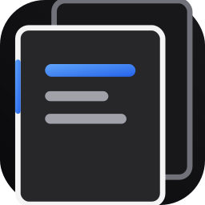
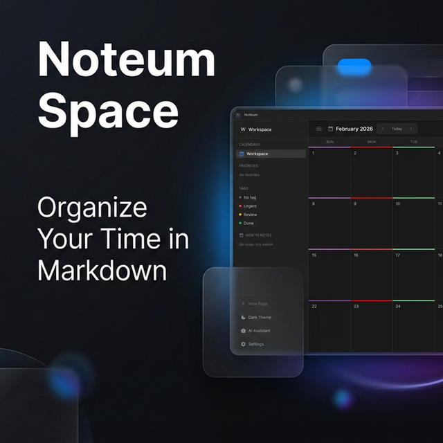

  
  <h1>Noteum</h1>
  
<b>A integrated calendar with markdown notes. Use it as your personal notebook for classes and daily tasks. </b>

  

    
    
  

 

  

 

##  Features

Noteum is designed for developers, students who need a beautiful and fast place to organize their lives.

-  **Advanced Markdown Editor**: Full GitHub flavored Markdown support with math (KaTeX), syntax highlighting, and tables.
-  **Slash Commands**: Type `/` to instantly insert lists, code blocks, math blocks, and formatting without losing flow.
-  **Integrated Calendar**: A beautiful grid calendar seamlessly connected to your daily notes.
-  **AI Assistant**: Built in AI chat using multiple powerful models (Gemini, Llama) to help you write and code.
-  **Modern UI**: Pure simplicity. Switch between light and dark mode instantly

---

##  Download Noteum

Experience Noteum natively on your desktop for the fastest performance.

### Windows

*Alternatively, download the `.exe` installer from the [Releases](https://github.com/NearSkys/Noteum/releases) page.*

### Linux

*Supports Ubuntu, Debian, Pop!_OS, Mint, and others.*

---

##  Web Version

Don't want to install anything? You can use the fully featured web version from any device.

👉 **[Access Noteum Web](https://noteum.space)**

---

##  Architecture

Noteum is built with a highly performant stack:
- **Backend**: Rust (Axum) ensuring maximum memory safety and performance.
- **Frontend**: Vanilla JS + HTML5 + CSS3 (Zero heavy frameworks).
- **Desktop**: Tauri (Lightweight and native WebVew).

---

  Built with ❤️ for productivity.

